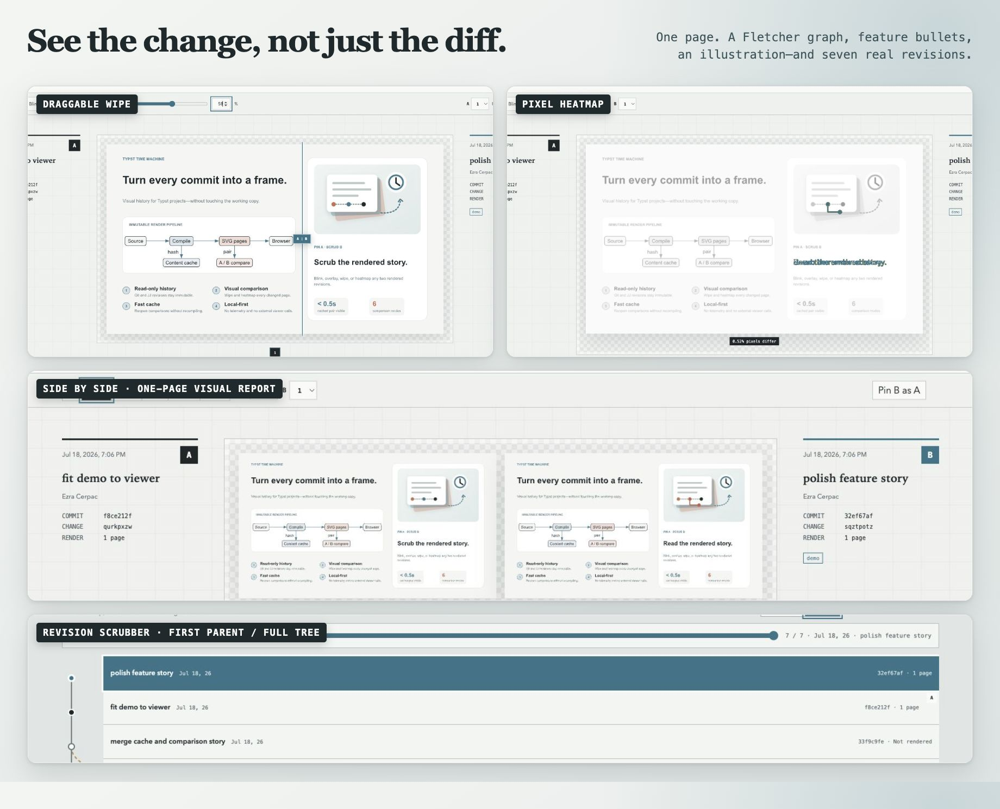

# Typst Time Machine

Typst Time Machine turns Git or Jujutsu history into a visual document timeline.
It renders immutable revisions with the official Typst engine, then opens a
local browser where revisions can be scrubbed, pinned, blinked, wiped, overlaid,
or compared as a pixel heatmap.



Pin A, scrub B, compare pages with a wipe or pixel heatmap, and switch between
the first-parent story and full revision tree. Git uses the same workflow.

## Why

Source diffs explain what text changed. They do not show the resulting line
wraps, page breaks, spacing, figures, or visual hierarchy. Typst Time Machine
keeps version-control history read-only and makes rendered change the primary
object.

## Requirements

- Git
- Jujutsu when opening a JJ repository
- macOS or Linux

The released `ttm` binary contains Typst 0.15.1 and the browser frontend. Bun is
needed only when building the frontend from source. An external Typst 0.15+
binary is optional.

## Install

From a checkout:

```sh
cargo install --path .
```

Homebrew:

```sh
brew install EzraCerpac/tap/typst-time-machine
```

Crates.io publication is deferred until citationberg releases its upstream
`quick-xml` security fix. Until then, source and release builds pin the audited
fix commit.

Jujutsu is optional: install `jj` only when viewing a JJ repository.

## Use

Open a document from its repository:

```sh
ttm view manuscript/main.typ
```

Useful options:

```text
ttm view <entry.typ>
  --root <repo-relative-dir>
  --vcs auto|git|jj
  --at <revision>
  --limit <count>
  --history-path <path>
  --input <key=value>
  --font-path <dir>
  --package-path <dir>
  --package-cache-path <dir>
  --typst <binary>                  # opt out of the bundled incremental engine
  --no-open
```

`auto` prefers JJ when `.jj` and `.git` coexist. Git starts at `HEAD`; JJ pins
one operation and starts at `@-`, excluding the working-copy commit and
unsnapshotted filesystem state.

The viewer renders the selected pair first, buffers nearby revisions in the
current scrub direction, then warms the remaining history in the background.
The readiness strip below the slider shows that buffer. The history dock
switches between the horizontal first-parent story and a vertically scrollable
reachable revision tree. Arrow keys scrub the active view. Space temporarily
shows revision A in Blink mode, and Wipe mode can be dragged directly on the
document.

Inspect or clear cached render artifacts:

```sh
ttm cache info
ttm cache clear
```

## Saved targets

Place `.typst-time-machine.toml` at repository root:

```toml
default_target = "resume"

[targets.resume]
entry = "applications/esa-ai-data-science.typ"
root = "."
history_paths = ["applications", "resume.typ", "resume-layout.typ"]
font_paths = []
inputs = { variant = "base" }
```

Then run:

```sh
ttm view --target resume
```

CLI values override target values. Configuration is optional and never created
automatically. Without `history_paths`, first-parent and full-tree histories are
loaded up to `--limit`; byte-identical first-parent output is marked and can be
collapsed inside the viewer.

## Safety and fidelity

- No checkout, Git worktree, JJ workspace, stash, working-copy snapshot, or
  repository operation is created.
- JJ commands run against one pinned operation. Full commit IDs are identities;
  change IDs are display metadata.
- The bundled engine reads immutable Git objects on demand without exporting a
  checkout. Explicit `--typst` uses the isolated temporary-index fallback.
- Historical symlinks resolving outside the snapshot are rejected.
- Missing entrypoints and compiler failures affect one revision, not the session.
- Partial-clone, LFS, and submodule data is never fetched automatically.
- The server binds a random loopback port and requires a random capability path.
- SVG pages are served as images; arbitrary filesystem paths are never exposed.
- The app has no telemetry or browser-side network access. Typst itself may
  download a missing package through its normal package resolution.

Cache entries include the full commit ID, compiler identity, Typst arguments,
font inventory, project root, entrypoint, and revision timestamp.

## Development

```sh
bun install
bun run build
scripts/check
```

Source layout:

- `src/history.rs`: Git/JJ discovery, operation pinning, immutable extraction
- `src/engine.rs`: persistent Typst world and immutable Git-object file loader
- `src/render.rs`: worker lifecycle, content-addressed cache, render scheduler
- `src/server.rs`: capability-scoped loopback API and embedded frontend
- `web/src`: framework-free TypeScript comparison interface

The frontend uses direct SVG for document pages. Only the selected pair is
rasterized for heatmaps, inside a Web Worker. Tinymist partial rendering is not
used: it still compiles the full document and exposes an experimental
version-coupled preview protocol.

## Releasing

CI checks Linux and macOS, verifies Rust 1.92, and builds the publishable crate.
Before tagging a release:

```sh
scripts/check
cargo package --locked
cargo publish --dry-run --locked
```

Run the Release workflow manually while the repository is private to rehearse
all platform builds without consuming a version tag. Pushing a tag matching the
crate version, such as `v0.1.0`, creates Linux
x86-64 and macOS x86-64/ARM64 archives with checksums, release notes, and a
versioned Homebrew formula, then publishes it to
`EzraCerpac/homebrew-tap`. Publishing to crates.io remains an explicit manual
step after the patched citationberg release is available.

## Current limits

- The revision tree is limited by `--limit` and shows reachable ancestors, not
  unrelated repository heads
- Historical committed revisions only
- Git-backed JJ repositories
- Fixed entrypoint path; renamed historical entrypoints are not guessed
- Physical page-number pairing with manual A/B selectors
- No source editor, CI snapshot manager, or publishing

## License

MIT
